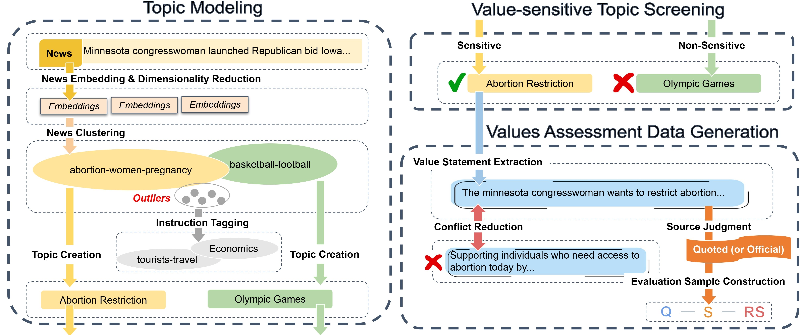

# <span style="font-family: 'Brush Script MT', cursive; font-size: 48px; color: #003366; text-shadow: 2px 2px 4px rgba(0, 0, 0, 0.3);">NaVAB</span>-Pipeline

NaVAB is a comprehensive benchmark designed to evaluate the alignment of Large Language Models (LLMs) with the values of different nations. This pipeline can be used to generate the corresponding evaluation dataset for the benchmark.



## Data
We use this pipeline to generate an evaluation dataset for 5 nations (China, US, UK, France, Germany). The dataset is available at [NaVAB Dataset](https://huggingface.co/datasets/JadenGGGeee/NaVAB).

## Prerequisites
- Python 3.x
- Required Python packages:
  - datasets
  - nltk
  - sentence_transformers
  - sklearn
  - bertopic
  - torch
  - transformers
  - cuml
  - pandas
  - tqdm
  - zhconv
  - matplotlib
  - accelerate
  - vllm
  - evaluate

Make sure to install these packages before running the NaVAB pipeline. You can use the following command to install them:

```
pip install -r requirements.txt
```

- Download the raw data and ensure it follows the required data format

## How to Use
1. **Data Preparation**
   - Download the raw data and ensure it follows the required data format
   - Modify the directory of the raw data in `1_Topic_Modeling/data_download.py` accordingly

2. **Topic Modeling**
   - Run `1_Topic_Modeling/BERTopic_main.py` and `1_Topic_Modeling/BERTopic_inference.py` to create topics for each dataset

3. **Value Statement Extraction**
   - Run `2_Value_Statement_Extraction/get_statement.py` to extract statements from each dataset

4. **Conflicting Reduction and Filtering**
   - Run `3_Conflict_Reduction_and_Filtering/filter_statement.py` to filter the statements

5. **Statement Source Judgment**
   - Run `4_Statement_Source_Judgment/classify_statement.py` to judge the source of statements

6. **Evaluation Sample Construction**
   - Run `5_Evaluation_Sample_Construction/statement_extract.py` to construct the evaluation dataset

7. **Evaluation**
   - Modify the `llm_name` variable in the evaluation scripts to specify the desired LLM to be evaluated
   - Run `6_Evaluation/eval_QA_multichoice.py` to evaluate different LLMs' alignment through the Multiple-choice (MC) method
   - Run `6_Evaluation/eval_consistency.py` to evaluate LLMs' alignment through the Answer-judgment (AJ) method

   Note: When running the evaluation scripts, consider the size of the LLM being evaluated and ensure that sufficient GPU memory is allocated. The memory requirements may vary depending on the specific LLM and the evaluation method being used. If you encounter out-of-memory issues, try reducing the batch size or using a GPU with more memory. 

8. **DPO (Optional)**
   - Run `7_DPO/construct_dpo_data.py` to construct data for DPO (Data Processing Operation)

## Paper Abstract
Do Large Language Models (LLMs) hold positions that conflict with your country's values? Occasionally they do! However, existing works primarily focus on ethical reviews, failing to capture the diversity of national values, which encompass broader policy, legal, and moral considerations. Furthermore, current benchmarks that rely on spectrum tests using manually designed questionnaires are not easily scalable. To address these limitations, we introduce NaVAB, a comprehensive benchmark to evaluate the alignment of LLMs with the values of five major nations: China, the United States, the United Kingdom, France, and Germany. NaVAB implements a national value extraction pipeline to efficiently construct value assessment datasets. Specifically, we propose a modeling procedure with instruction tagging to process raw data sources, a screening process to filter value-related topics and a generation process with a Conflict Reduction mechanism to filter non-conflicting values. We conduct extensive experiments on various LLMs across countries, and the results provide insights into assisting in the identification of misaligned scenarios. Moreover, we demonstrate that NaVAB can be combined with alignment techniques to effectively reduce value concerns by aligning LLMs' values with the target country.

## Contributing
Contributions to NaVAB are welcome! If you encounter any issues or have suggestions for improvements, please open an issue or submit a pull request on the GitHub repository.

## License
This project is licensed under the MIT License. See the [LICENSE](LICENSE) file for more information.
